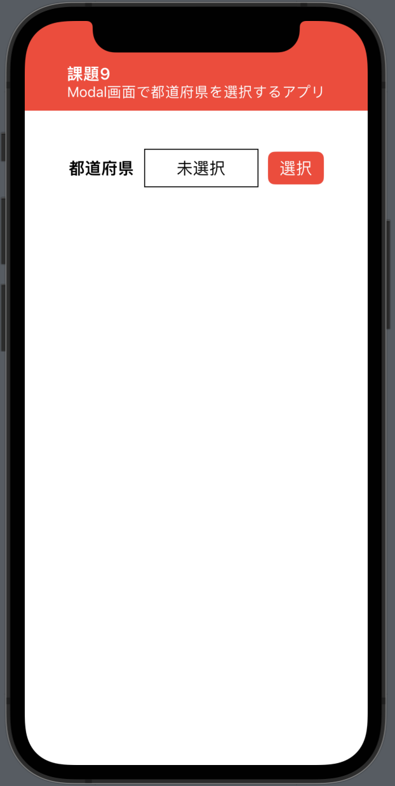
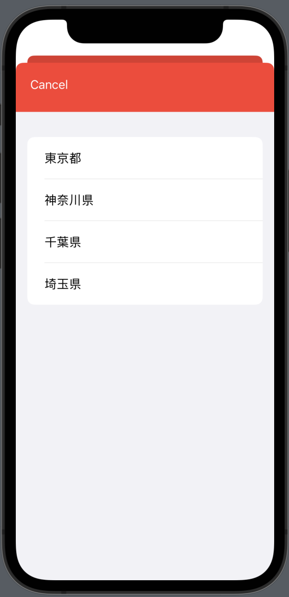

# 課題9 Modal画面で都道府県を選択するアプリ
## Overview

都道府県選択する画面。

選択ボタンを押すとモダール画面が開き、都道府県の選択肢が表示される。

モダール画面にはキャンセルボタンと、都道府県名リストが掲載されている。

都道府県名を押すと都道府県が選択されてモダール画面が閉じ、都道府県選択画面に選択された都道府県名が表示されている。

 
 
## Memo
<ul>
  <li>SwiftUI</li>
  <li>sheet</li>
  <li>@State, @Binding</li>
  <li>都道府県の選択肢をButtonで実装したので、Listの1行全体がボタンとなった。Listの1行の中に複数ボタンを設置する場合はTextに.onTabGestureモディファイアがよい模様</li>
</ul>

## FB
<ol>
<li>toolbarの背景色をZStackで設定せず、.toolbarBackground(_:,for:)にて設定すべき</li>
<li>モダール表示の場合、遷移先で再度NavigationStackを記述</li>
</ol<
